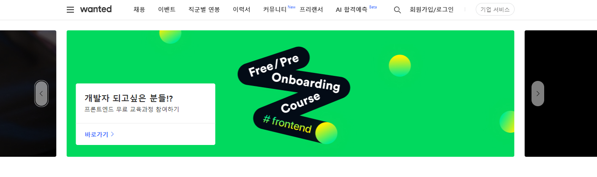
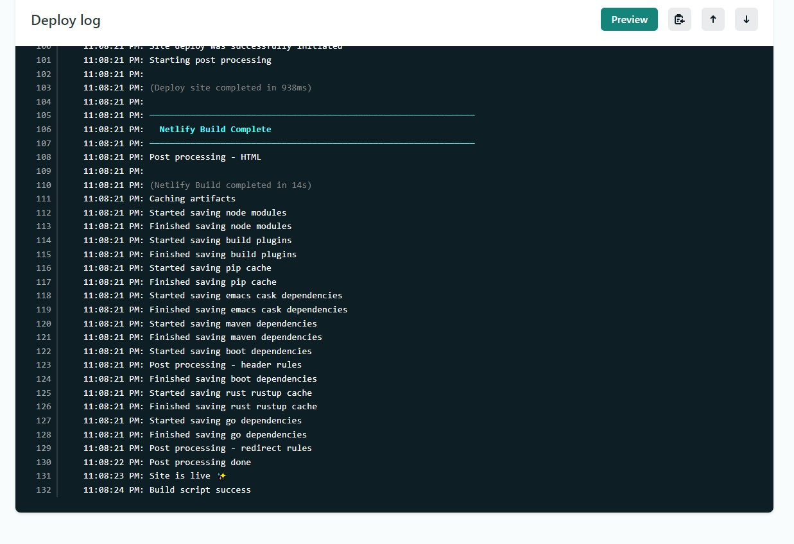

# [위코드 X 원티드] 프론트엔드 프리온보딩 선발 과제👩‍💻

__배포 링크🌟 __https://220119.netlify.app/

##  구현 목록

### 1. 상단 상단 GNB(Global Navigation Bar)

- [x] 네브바 마크업만 작업 (HTML, CSS)
- [x] 간단한 hover 기능 추가 

### 2. 슬라이드(Carousel)

- [x] 슬라이드 구현하기 위해 리액트의 framer-motion를 사용하려고 시도하다가 실패하여 css속성들을 통해 구현함
- [x] 스와이프 구현 시 -> onDragStart, onDragEnd 이벤트를 사용하였는데 슬라이드에서 이미지를 넘기려고 할 때 잔상이 생기는 문제가 발생 ->  `style="-webkit-user-drag: none;"` 속성을 주면 이미지 잔상은 막을 수 있지만 드래그가 불가능하여 스와이프가 제대로 동작하지 않는 문제가 있어 드래그를 따로 막지 않음. 스와이프 동작을 임시로 구현하였고, 이미지를 자유롭게 이끌어 이동시킬 수 있도록 추가 구현이 필요함.

### 3. 반응형(Responsive Web) 

- [x] 반응형은 미디어 쿼리 사용하여 구현

### 4. netlify 배포

- [x] 처음 사이트를 배포했을 당시, 슬라이드 컨테이너에 너비 값을 주지 않아 나머지 이미지들이 자리를 이탈하여 배열이 깨지는 문제가 발생하였고 너비값을 지정하여 해결

